# @tethral/acr-mcp

MCP server for the [ACR](https://acr.nfkey.ai) (Agent Composition Records) network. Log agent interactions, build an interaction profile, and query it through behavioral lenses.



## 60-second quickstart

No signup. No API key. No credit card. `npx` and go.

Add to your project (`.mcp.json` — works with Claude Code, Cursor, Continue, any MCP client):

```json
{
  "mcpServers": {
    "acr": {
      "command": "npx",
      "args": ["-y", "@tethral/acr-mcp@latest"]
    }
  }
}
```

Or run directly:

```bash
npx -y @tethral/acr-mcp          # stdio transport
npx -y @tethral/acr-mcp-http     # HTTP transport
```

On first use your agent auto-registers and gets a human-readable name (e.g. `anthropic-amber-fox`). That's it — start calling `log_interaction` after every external tool call and the lenses fill in as receipts accumulate. Call `get_my_agent` any time to see your agent ID, API key, and dashboard link.

Want an API key for authenticated writes? You already have one — `get_my_agent` returns it. But the ingest path accepts unauthenticated writes too, so low-barrier onboarding just works.

## What It Does

ACR is an **interaction profile registry** — not a security product, not a skill store.

1. **Agent registers** — composition is recorded (what skills, MCPs, tools it has)
2. **Agent logs interactions** — every external tool call, API request, or MCP interaction
3. **Signals compile into an interaction profile** — timing, chain position, retries, anomaly flags
4. **Lenses interpret the profile** — friction, coverage, stable corridors, failure registry, trend
5. **Anomaly signal notifications** — if ACR observes anomaly signals affecting a component in your composition, you get a notification

## Lenses at a glance

> Free tier: summary, top 3 targets, trend, coverage, stable corridors. Paid tier adds: baselines, retry overhead, directional analysis, population drift.

| Lens | Ask it when… | Key output | Act on it by… |
|---|---|---|---|
| `get_friction_report` | Where is my time going? | Top targets by wait share, retry waste, chain overhead | Caching slow targets, reducing retries on high-failure ones, replacing consistently failed vendors |
| `get_failure_registry` | What's breaking and how? | Status codes, error categories per target | Checking error codes to distinguish transient failures from config errors |
| `get_stable_corridors` | What can I rely on? | Zero-failure, low-variance targets | Routing critical-path work through the zero-failure targets |
| `get_trend` | Getting better or worse? | Failure rate and latency delta vs last period | Investigating rising failure rates before they compound; checking notifications if a target degraded |
| `get_coverage` | Am I logging enough? | Which receipt fields are missing and what they unlock | Adding the missing fields to your `log_interaction` calls to unlock the gaps |
| `summarize_my_agent` | Quick status check? | Profile + friction + coverage in one call | Getting a one-call status check at the start or end of a session |

## Example output

```
Friction Report for anthropic-amber-fox (week)
Agent ID: agt_01abc123def456
Period: 2026-04-10T00:00:00Z to 2026-04-17T00:00:00Z
Tier: free

── Summary ──
  Interactions: 312
  Total wait: 84.3s
  Friction: 11.8% of active time
  Failures: 9 (2.9% rate)
  Shadow tax: 22.9% of wait (failed 18.5s · retries 19.8s · chain queue 4.0s)

── By Category ──
  tool_call: 287 calls, 77.4s total, avg 270ms | median 240ms | p95 1820ms
  delegation: 25 calls, 6.9s total, avg 276ms | median 210ms | p95 980ms

── Top Targets ──

  api:openai.com (api)
    198 calls | 68.2% of wait time (57.5s)
    median 290ms | p95 1850ms
    faster than 41% of agents on this target
    faster than 78% of anthropic peers (cohort: 14)

  mcp:filesystem (mcp_server)
    89 calls | 18.4% of wait time (15.5s)
    median 174ms | p95 620ms

── Chain Analysis ──
  Distinct chains: 14
  Avg chain length: 3.2 calls
  Total chain overhead: 4.1s

── Directional Analysis ──
  None recorded this week.

── Retry Overhead ──
  None recorded this week.

── Population Drift ──
  None recorded this week.
```

## Tools (25)

### Your agent
| Tool | Purpose |
|------|---------|
| `get_my_agent` | Your agent ID, API key, dashboard link, health snapshot, and menu of available lenses. The entry point to ACR. |
| `getting_started` | Step-by-step setup checklist: registration, logging, composition, coverage, and your next action. |
| `register_agent` | Explicit registration with composition. Auto-registration is the default on first call. |
| `update_composition` | Update your composition without re-registering. Preserves agent identity. |
| `configure_deep_composition` | Privacy control: enable/disable sub-component capture for this session. |

### Interaction logging
| Tool | Purpose |
|------|---------|
| `log_interaction` | Record an interaction. Call after every external tool call, API request, or MCP interaction. Every lens depends on this. |
| `get_interaction_log` | Paginated interaction history with network context. |

### Behavioral lenses
| Tool | Purpose |
|------|---------|
| `get_friction_report` | Where time and tokens are lost: top targets, chain overhead, retry waste. Paid: population baselines (`vs_baseline`, `baseline_median_ms`, `volatility`), retry overhead, directional analysis (`directional_pairs`), population drift, population comparison. |
| `get_profile` | Full interaction profile: identity, counts, composition summary, composition delta. |
| `summarize_my_agent` | One-read overview across profile, friction, and coverage lenses. |
| `get_coverage` | Signal completeness: which fields you populate on receipts, which you don't. |
| `get_stable_corridors` | Reliably fast interaction paths: zero failures, low variance, high sample count. |
| `get_failure_registry` | Per-target failure breakdown: status codes, error codes, categories. |
| `get_trend` | Latency and failure rate changes: current vs previous period, raw deltas. |
| `get_revealed_preference` | Declared-but-uncalled bindings vs called-but-undeclared targets: where real behavior diverges from composition metadata. |
| `get_compensation_signatures` | Repeated multi-hop patterns an agent falls back on: chain-shape stability, frequency, and fleet-wide comparison when available. |

### Anomaly signal notifications
| Tool | Purpose |
|------|---------|
| `check_environment` | Active anomaly signals and network observations. Call on startup. |
| `get_notifications` | Unread anomaly signal notifications about components in your composition. |
| `acknowledge_threat` | Acknowledge a notification after reviewing with your operator. Expires in 30 days. |

### Network observation
| Tool | Purpose |
|------|---------|
| `get_network_status` | Network-wide dashboard: agent/system totals, signal rates, skill anomalies, escalations. |
| `get_skill_tracker` | Adoption and anomaly signals for skills observed by the network. |

### Lookups
| Tool | Purpose |
|------|---------|
| `check_entity` | Ask the network what it knows about a specific skill, agent, or system. |
| `search_skills` | Query the network's knowledge of a skill by name. |
| `get_skill_versions` | Version history for a skill hash. |

## Dashboard

View your agent's profile and friction analysis at [dashboard.acr.nfkey.ai](https://dashboard.acr.nfkey.ai). Requires your agent ID and API key (shown by `get_my_agent`).

The [public leaderboard](https://dashboard.acr.nfkey.ai/leaderboard) shows anonymous aggregate data — most used MCP servers, reliability rankings, skill adoption — no auth required.

## Configuration

| Env Var | Default | Description |
|---------|---------|-------------|
| `ACR_API_URL` | `https://acr.nfkey.ai` | API endpoint |
| `ACR_RESOLVER_URL` | Same as API URL | Resolver endpoint |
| `ACR_DEEP_COMPOSITION` | `true` | Set to `false` to disable sub-component capture |
| `ACR_DASHBOARD_URL` | `https://dashboard.acr.nfkey.ai` | Dashboard URL shown in get_my_agent |

## Registering your composition

`update_composition` accepts three fields. Here's where to get the values:

- **`skill_hashes`**: SHA-256 of the SKILL.md file content. Shell: `sha256sum path/to/SKILL.md | cut -d' ' -f1`. Node: `crypto.createHash('sha256').update(fs.readFileSync('SKILL.md')).digest('hex')`.
- **`mcp_components`**: Use the MCP server name as you have it in your settings (e.g. `"github"`, `"filesystem"`). These are the keys under `mcpServers` in your config.
- **`api_components`**: The target system IDs you log to (e.g. `"api:openai.com"`). These should match what you pass as `target_system_id` in `log_interaction`.

These values are used by ACR to match your composition against the network's anomaly signal observations. If a skill or MCP you use has elevated signals, you'll receive a targeted notification.

## Troubleshooting

**Friction report is empty**

Call `get_coverage` to check which signals you're populating. If `total_interactions` is 0, you haven't called `log_interaction` yet — every lens depends on logged receipts. Try a broader scope: `get_friction_report` with `scope: "week"` or `scope: "yesterday"`.

**Dashboard shows no data**

The dashboard updates as receipts arrive. If you've logged interactions but see nothing, confirm your agent ID matches: call `get_my_agent` and check the dashboard link it returns. Data is scoped per agent — other agents' data isn't visible on your profile.

**Targeted notifications aren't arriving**

Call `getting_started` — Step 3 checks composition. If your composition is empty (0 skills, 0 MCPs, 0 tools), anomaly notifications are network-wide only. Call `update_composition` with your current stack to enable targeted alerts.

## Data Collection

ACR collects interaction **metadata only**: target system names, timing, status, and provider class. No request/response content, API keys, prompts, or PII is collected. We intentionally don't track the agent's owner. [Full terms](https://acr.nfkey.ai/terms).

## License

MIT
